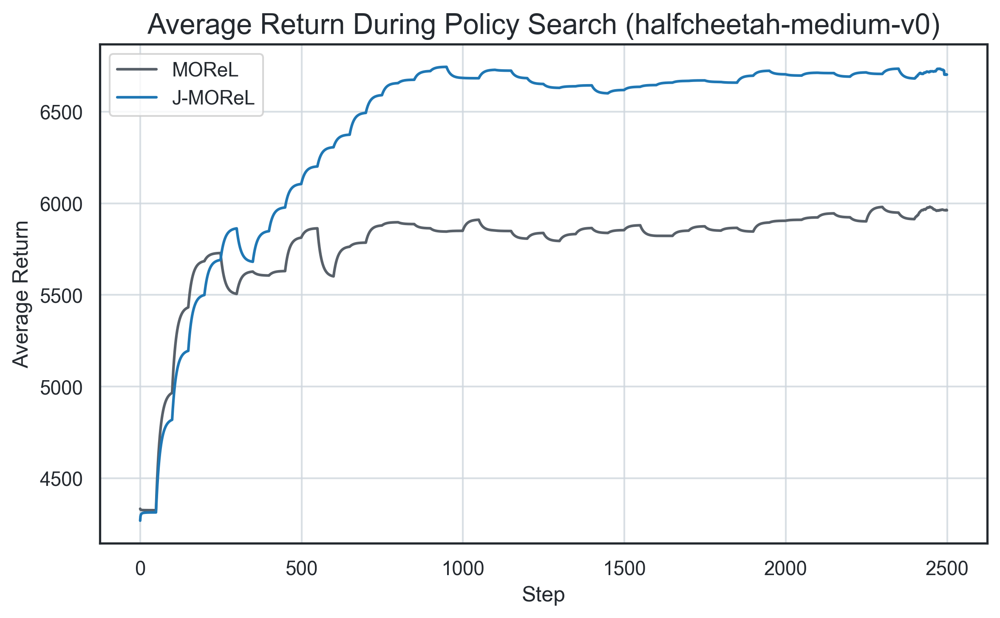

# J-MOReL: Improved Reimplementation of MOReL

## Overview
This repository provides a clean and modular reimplementation of MOReL (Kidambi et al., NeurIPS 2020), a model-based offline reinforcement learning framework that builds pessimistic MDPs to handle uncertainty in the predictions of the models. It also includes several improvements to MOReL and model-based RL that I proposed in my MSc. thesis (link [here](https://ulb-dok.uibk.ac.at/ulbtirolhs/content/titleinfo/12445583)), listed below.

## Key Improvements
- Neural networks ensemble (the model): 
  - Deeper networks.
  - Learning rate schedulers.
  - Elite ensemble members.
  - Networks that learn the parameters of a Gaussian distribution.
- Observation normalization: normalization of input states across all components.
- Disagreement scaling: Jacobian variance-based scaling to improve disagreement calculation.

## Configuration

All configuration files are included in the `configs` directory. For training the ensemble, and example config is the following:

```yaml
env_name: HalfCheetah-v2 # Gym environment
activation: swish # Activation function (swish or relu)
fit_epochs: 600 # Number of training steps
hidden_size: # Size of each hidden layer
- 512
- 512
- 512
- 512
num_models: 7 # Number of networks for the ensemble
probabilistic: true # Learn the variance
scheduler: ExponentialLR # Scheduler (none or ExponentialLR)
scheduler_gamma: 0.995 # Gamma parameter for ExponentialLR
device: cuda # 'cuda' (for gpu) or 'cpu'
```

An example config for policy search using MOReL shown below. Note that the `pessimism coefficient` should be tuned, tips are shown in the `Example Usage` section. 
```yaml
env_name: 'HalfCheetah-v2' # Gym environment

# File with reward and termination functions
reward_file: 'reward_functions/gym_halfcheetah.py'

pessimism_coef: 0.5 # Controls the disagreement threshold
penalty: -200.0 # Reward assigned to penalized transitions
num_iter: 2500 # Number of policy optimization steps
update_paths: 40 # Number of trajectories used to update policy
horizon: 1000 # Length of trajectories generated with ensemble
eval_rollouts: 25 # Number of trajectories used for evaluation

# Control policy outputs
init_log_std: -1.0
min_log_std: -1.0

device: 'cuda' # 'cuda' (for gpu) or 'cpu'
```

## Setup

The python version used is 3.10.0 and the dependencies must be installed with:

```bash
pip install -r requirements.txt
```

It is also necessary to download and install the package where I define the ensembles of dynamics models (this allows to view and edit the code):

```bash
git clone https://github.com/AndrewKM210/dynamics-ensembles-rl.git
cd dynamics-ensembles-rl
pip install -e .
cd ..
```

## Example Usage

### Using Trained Ensembles

The weights of the fully trained ensembles used for the [Results section](#Results) section are included in [this HuggingFace repository](https://huggingface.co/AndrewKM210/dynamics-ensembles-rl). These can be downloaded to the *ensembles_hf* directory with:
```bash
git clone https://huggingface.co/AndrewKM210/dynamics-ensembles-rl ensembles_rf
```

The ensembles must be reconstructed from the weights with:
```bash
python dynamics-ensembles-rl/convert_hf_ensemble.py --input ensembles_hf/halfcheetah_medium --output ensembles/halfcheetah_medium.pkl
```

The datasets the ensembles were trained on must be processed and saved to a file:
```bash
python dynamics-ensembles-rl/load_dataset.py --dataset halfcheetah-medium-v0 --output datasets/halfcheetah_medium.pkl
```

### Training Ensembles

If not using one of the published ensembles, the `learn_model.py` script can be used to download the dataset and train an ensemble of dynamics models. The `dataset_path` must be specified to save the processed dataset for policy search. More instructions on how to train an ensemble can be found in the [README.md of dynamics-ensembles-rl](dynamics-ensembles-rl/README.md).

```bash
python dynamics-ensembles-rl/train_ensemble.py --dataset halfcheetah-medium-v0 --dataset_path datasets/halfcheetah_medium.pkl --config dynamics-ensembles-rl/configs/halfcheetah_pnn.yaml --output ensembles/halfcheetah_medium.pkl
```

### Training J-MOReL

The `train_morel.py` script trains a policy with the previous dataset and ensemble using the MOReL framework. The pessimism coefficient shoud be tuned depending on the ensemble. 

```bash
python train_morel.py --config configs/d4rl_halfcheetah.yaml --data_path datasets/halfcheetah_medium.pkl --ensemble_path ensembles/halfcheetah_medium.pkl --output output --pessimism_coef 50
```

Parameters in the config file can be overriden with the `params` argument. The `track_eval` argument will compute the evaluation return in all training steps (otherwise every 50th to optimize execution time).The final policy and logs will be saved in the directory specified by the `output` argument. Additionally, [guildai](https://github.com/guildai/guildai) can be used to manage and track experiments with the `guild.yml` config file. This library can be useful for staging and tracking experiments in clusters (combined with SLURM). To install guildai:

```bash
pip install guildai
# pip install 'pydantic<2' fixes NameError
```

With the current guildai version, a "NameError: Fields must not use names with leading underscores" error is returned when running `guild run`, install 'pydantic<2' to fix this. For running a train_ensemble experiment, check the dynamics-ensembles-rl README ([here](https://github.com/AndrewKM210/dynamics-ensembles-rl/blob/main/README.md)). An example of running a train_morel experiment with custom parameters is:

```bash
guild run train_morel config=configs/d4rl_halfcheetah.yaml data_path=${PWD}/datasets/halfcheetah_medium.pkl ensemble_path=${PWD}/ensembles/halfcheetah_medium.pkl output=output pessimism_coef=50
```

Experiments can be tracked in real time with `guild tensorboard`. The final results of several runs can be compared and stored to a .csv file with `guild compare --csv results.csv`.

Tips for tuning the pessimism coefficient:
- `paths_truncated`:
    - No paths truncated → decrease pessimism coefficient
    - Most paths truncated → increase pessimism coefficient
- `train_score` vs `eval_score`
    - Use `--track_eval` to track `eval_score` in each training step
    - Ideally `train_score` should track `eval_score` closely without surpassing it
    - `train_score` barely increasing → increase pessimism coefficient
    - `train_score` significantly exceeding `eval_score` → decrease pessimism coefficient

## Results

All results are shown in [my thesis](https://ulb-dok.uibk.ac.at/ulbtirolhs/content/titleinfo/12445583), the [results/plot_results.ipynb](results/plot_results.ipynb) notebook gives an example on how to plot the average return using the generated logs. The following figure shows how the proposed improvements outperform the original MOReL framework. To replicate the MOReL experiments, set the `disc_scale` and `obs_scale` parameters to 'morel', and train the ensemble using one of the MOReL configs.

<picture>
    <source media="(prefers-color-scheme: dark)" srcset="assets/avg_return_dark.png">
    
</picture>

## Work in Progress
- Track metrics in train_morel.py with MLflow.
- Upload only weights to HuggingFace (pickles are marked as unsafe), convert into ensemble here.

## Citation

If you use this code in your research, please cite the original paper:
> **Kidambi et al.,**
> *"MOReL: Model-Based Offline Reinforcement Learning",*
> *NeurIPS 2020.*

```bibtex
@inproceedings{kidambi2020morel,
  title={MOReL: Model-Based Offline Reinforcement Learning},
  author={Kidambi, Rahul and Rajeswaran, Aravind and Netrapalli, Praneeth and Joachims, Thorsten},
  booktitle={NeurIPS},
  year={2020}
}
```
And if you reference these improvements (publishing pending):

```bibtex
@mastersthesis{parrott2025mbrl,
  title        = {Model-based Reinforcement Learning: Optimizing Action Choice on Learned Dynamics},
  author       = {Mackay Parrott, Andrew Keon},
  school       = {University of Innsbruck},
  year         = {2025},
  month        = {oct},
  url          = {https://ulb-dok.uibk.ac.at/ulbtirolhs/content/titleinfo/12445583}
}
```

## Acknowledgements
This reimplementation is based on the original MOReL paper and [code](https://github.com/aravindr93/mjrl/tree/v2/projects/morel).